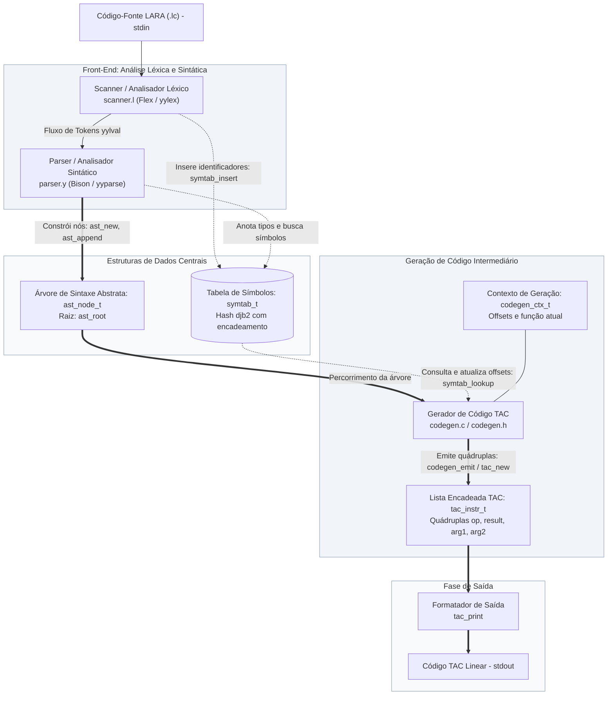
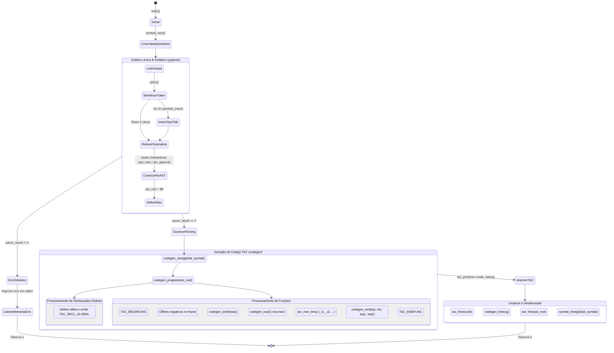
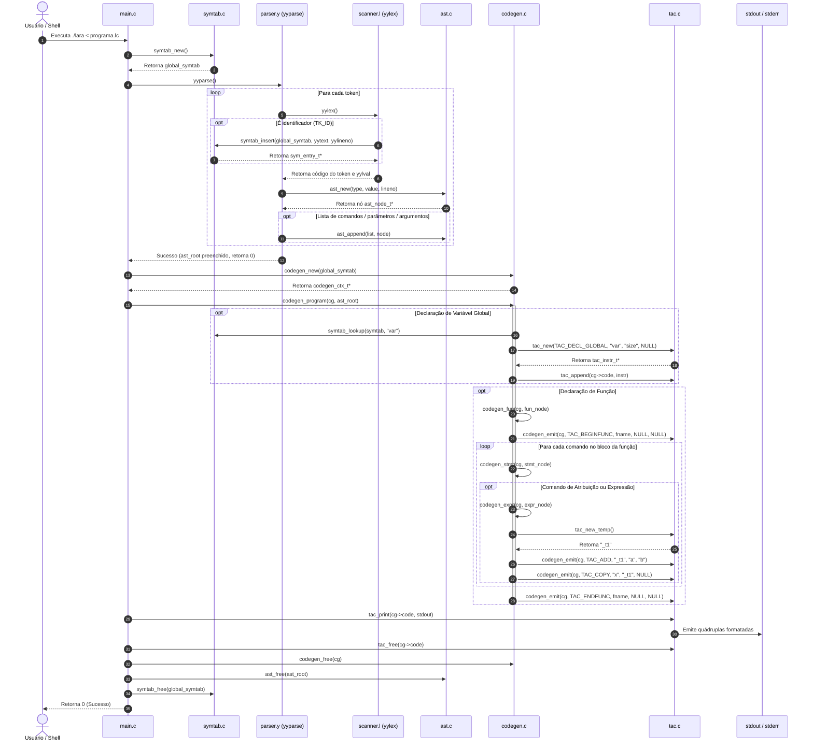

# Arquitetura, Estruturas de Dados e Funções do Compilador LARA (Etapa 2)

**Disciplina:** INF01083 — Linguagens de Programação II / Compiladores — 2026/1
**Instituição:** Instituto de Informática — UFRGS
**Projeto:** Compilador da Linguagem LARA — Etapa 2: Geração de Código de Três Endereços (TAC) Básico

---

## 1. Diagrama de Arquitetura (Pipeline do Compilador)

O compilador processa o programa-fonte em fases bem delimitadas: Front-End (análise léxica, análise sintática, tabela de símbolos e construção da Árvore de Sintaxe Abstrata — AST) e Representação Intermediária (percorrimento da AST, resolução de escopo/offsets e geração do código de três endereços — TAC).

---

## 2. Diagrama de Atividades

Descreve o fluxo de controle e decisões desde o início do processo em `main.c` até a impressão e desalocação final.

---

## 3. Diagrama de Sequência

Ilustra a troca de mensagens e chamadas de funções entre os componentes durante o ciclo de compilação.

---

## 4. Descrição das Estruturas de Dados

### 4.1. `ast_node_t` — Nó da Árvore de Sintaxe Abstrata (AST)

* **Arquivo de Definição:** `src/ast.h`

| Atributo     | Tipo                                    | Descrição                                                                                                                                         |
| :----------- | :-------------------------------------- | :-------------------------------------------------------------------------------------------------------------------------------------------------- |
| `type`     | `ast_node_type_t`                     | Tipo/natureza do nó sintático (ex:`AST_PROGRAM`, `AST_FUN_DECL`, `AST_ASSIGN`, `AST_EXPR_BINARY`, `AST_SYMBOL`, etc.).                  |
| `value`    | `char *`                              | Lexema associado (para folhas como símbolos/literais) ou operador (ex:`"+"`, `"-"`, `"<="`, `":="`). `NULL` para nós estruturais puros. |
| `lineno`   | `int`                                 | Número da linha no arquivo-fonte em que o nó foi instanciado (proveniente de`yylineno`).                                                        |
| `children` | `struct ast_node *[AST_MAX_CHILDREN]` | Vetor fixo de 4 ponteiros para nós filhos, permitindo árvores n-árias com aridade até 4.                                                        |
| `next`     | `struct ast_node *`                   | Ponteiro para o próximo nó em sequências horizontais (listas de comandos, declarações, parâmetros ou argumentos).                             |

* **Necessidade:**
  O analisador sintático produz uma representação hierárquica intermediária (AST) sem ambiguidades léxicas/sintáticas. O gerador de código precisa percorrer essa árvore para gerar o código TAC.
* **Funcionamento:**
  A AST adota um modelo híbrido:
  1. **Hierarquia vertical (Pai-Filho):** nós como `if`, `while`, `for`, `fun_decl` e operações binárias utilizam posições bem definidas em `children[]` (ex.: `children[0]` = condição, `children[1]` = bloco *then*, `children[2]` = bloco *else*).
  2. **Encadeamento horizontal (Listas ligadas):** sequências de comandos em um bloco ou declarações no topo do programa são encadeadas pelo ponteiro `next` usando a função `ast_append()`.

---

### 4.2. `symtab_t` e `sym_entry_t` — Tabela de Símbolos

* **Arquivo de Definição:** `src/symtab.h`

#### Atributos de `sym_entry_t` (Entrada de Símbolo):

| Atributo       | Tipo                   | Descrição                                                                                                           |
| :------------- | :--------------------- | :-------------------------------------------------------------------------------------------------------------------- |
| `lexeme`     | `char *`             | Nome do identificador (alocado dinamicamente com`strdup`)                                                           |
| `lineno`     | `int`                | Linha da primeira ocorrência/declaração no código-fonte                                                           |
| `nature`     | `sym_nature_t`       | Natureza do símbolo:`SYM_VAR` (escalar), `SYM_ARRAY` (vetor) ou `SYM_FUNCTION` (função)                      |
| `datatype`   | `sym_datatype_t`     | Tipo de dado primitivo:`SYM_TYPE_INT`, `SYM_TYPE_FLOAT`, `SYM_TYPE_CHAR`, `SYM_TYPE_BOOL`, `SYM_TYPE_VOID`. |
| `offset`     | `int`                | Deslocamento em bytes no segmento`.bss` (global) ou no frame de ativação da pilha (local/parâmetro).             |
| `scope`      | `sym_scope_t`        | Escopo:`SYM_SCOPE_GLOBAL` ou `SYM_SCOPE_LOCAL`                                                                    |
| `array_size` | `int`                | Quantidade de elementos se for array (`nature == SYM_ARRAY`)                                                        |
| `next`       | `struct sym_entry *` | Ponteiro para o próximo nó na lista de colisões do mesmo bucket                                                    |

#### Atributos de `symtab_t` (Tabela Principal):

| Atributo    | Tipo                           | Descrição                                                                                                             |
| :---------- | :----------------------------- | :---------------------------------------------------------------------------------------------------------------------- |
| `buckets` | `sym_entry_t *[SYMTAB_SIZE]` | Vetor de ponteiros de tamanho primo fixo (`SYMTAB_SIZE = 509`), cada um iniciando uma lista encadeada para colisões. |
| `count`   | `int`                        | Quantidade total de símbolos únicos armazenados na tabela.                                                            |

* **Necessidade:**
  Armazenar metadados semânticos de cada identificador (tipo, tamanho, escopo e posição em memória/offset), permitindo verificar declarações e calcular endereçamento para instruções TAC e geração de código assembly futuro.
* **Funcionamento:**
  Utiliza o algoritmo de espalhamento `hash_djb2`. Inserções não duplicam entradas existentes: se o lexema já existe no bucket, retorna o ponteiro existente; caso contrário, aloca nova entrada e a insere no topo da lista ligada do bucket ($O(1)$ LIFO).

---

### 4.3. `tac_instr_t` — Instrução TAC (Quádrupla)

* **Arquivo de Definição:** `src/tac.h`

| Atributo   | Tipo                   | Descrição                                                                                              |
| :--------- | :--------------------- | :------------------------------------------------------------------------------------------------------- |
| `op`     | `tac_op_t`           | Opcode da instrução TAC (ex.:`TAC_ADD`, `TAC_COPY`, `TAC_DECL_GLOBAL`, `TAC_BEGINFUNC`, etc.). |
| `result` | `char *`             | Registrador de destino, variável de destino ou nome do rótulo/função.                                |
| `arg1`   | `char *`             | Primeiro operando (ou único operando em unários/declarações).                                        |
| `arg2`   | `char *`             | Segundo operando (em operações binárias ou contagem de argumentos).                                   |
| `next`   | `struct tac_instr *` | Ponteiro para a próxima instrução linear da lista encadeada.                                          |

* **Necessidade:**
  Fornecer uma representação intermediária linear de três endereços (*Three-Address Code*), simplificando expressões complexas em sequências de instruções com no máximo 2 operandos e 1 resultado.
* **Funcionamento:**
  As instruções formam uma lista simplesmente encadeada. Conforme a AST é percorrida recursivamente, quádruplas são instanciadas via `tac_new()` e adicionadas ao final da lista via `tac_append()`.

---

### 4.4. `codegen_ctx_t` — Contexto do Gerador de Código

* **Arquivo de Definição:** `src/codegen.h`

| Atributo         | Tipo              | Descrição                                                                                              |
| :--------------- | :---------------- | :------------------------------------------------------------------------------------------------------- |
| `code`         | `tac_instr_t *` | Ponteiro para a cabeça da lista linear de instruções TAC geradas até o momento.                      |
| `symtab`       | `symtab_t *`    | Ponteiro para a tabela de símbolos global usada para consultas e atualizações de escopo/offset.       |
| `current_func` | `char *`        | Nome da função atualmente sendo percorrida e compilada.                                                |
| `local_offset` | `int`           | Contador do próximo offset disponível (em bytes) para variáveis locais no frame da função corrente. |

* **Necessidade:**
  Manter o estado mutável durante a travessia da AST, acumulando o código intermediário e controlando escopos e offsets sem uso de variáveis globais dispersas.
* **Funcionamento:**
  Instanciado no início da fase de codificação com `codegen_new()`, passado por referência para todas as rotinas `codegen_*` e liberado com `codegen_free()`.

---

## 5. Descrição das Principais Funções

### 5.1. Ponto de Entrada (`main.c`)

* `int main(int argc, char *argv[])`
  * **Papel:** Ponto de entrada do executável `lara`.
  * **Funcionamento:**
    1. Aloca e inicializa `global_symtab` via `symtab_new()`.
    2. Executa a análise léxica e sintática chamando `yyparse()`. Se houver erro léxico/sintático, finaliza retornando `1`.
    3. Inicializa o contexto de codificação `codegen_new()`.
    4. Invoca `codegen_program()` sobre `ast_root`.
    5. Imprime o TAC na saída padrão com `tac_print()`.
    6. Libera todas as estruturas de dados alocadas (`tac_free`, `codegen_free`, `ast_free`, `symtab_free`) e retorna `0`.

---

### 5.2. Módulo AST (`ast.h`, `ast.c`, `ast_walk.c`)

* `ast_node_t *ast_new(ast_node_type_t type, const char *value, int lineno)`
  * **Papel:** Aloca (`calloc`) e inicializa um novo nó da AST. Duplica a string `value` se não for nula e registra a linha de origem.
* `void ast_add_child(ast_node_t *parent, int index, ast_node_t *child)`
  * **Papel:** Associa um nó filho a uma posição específica (`0` a `3`) no array `children` do nó pai.
* `ast_node_t *ast_append(ast_node_t *list, ast_node_t *node)`
  * **Papel:** Insere `node` ao final da lista encadeada horizontal (campo `next`) iniciada em `list`. Retorna o início da lista.
* `void ast_print(const ast_node_t *root, int indent, FILE *out)`
  * **Papel:** Imprime recursivamente a estrutura em árvore da AST com indentação e detalhes dos nós para depuração.
* `void ast_free(ast_node_t *root)`
  * **Papel:** Libera recursivamente toda a memória alocada para os nós, seus filhos, encadeamentos `next` e lexemas `value`.
* `const char *ast_type_name(ast_node_type_t type)`
  * **Papel:** Mapeia o valor enum de `type` para uma string legível (ex.: `"EXPR_BINARY"`, `"FUN_DECL"`).
* `int ast_count_nodes(const ast_node_t *node)`
  * **Papel:** Percorre recursivamente a AST contabilizando o número total de nós existentes.
* `int ast_count_leaves(const ast_node_t *node)`
  * **Papel:** Percorre a árvore contabilizando nós folha (nós cujos filhos são nulos).
* `int ast_max_depth(const ast_node_t *node)`
  * **Papel:** Calcula a profundidade máxima da árvore (maior caminho da raiz até uma folha).

---

### 5.3. Módulo Tabela de Símbolos (`symtab.h`, `symtab.c`)

* `static unsigned int hash_djb2(const char *str)`
  * **Papel:** Função de hash não-criptográfica djb2 de Daniel J. Bernstein ($hash = hash \times 33 + c$), gerando um índice no intervalo $[0, 508]$.
* `symtab_t *symtab_new(void)`
  * **Papel:** Aloca a estrutura da tabela de símbolos e zera os 509 buckets.
* `sym_entry_t *symtab_insert(symtab_t *tab, const char *lexeme, int lineno)`
  * **Papel:** Busca pelo `lexeme`. Se já existir, retorna a entrada existente; caso contrário, cria uma nova entrada `sym_entry_t` com valores padrão (`SYM_UNKNOWN`) e insere no início do bucket correspondente ($O(1)$).
* `sym_entry_t *symtab_lookup(symtab_t *tab, const char *lexeme)`
  * **Papel:** Procura por `lexeme` no bucket calculado via hash. Retorna ponteiro para `sym_entry_t` se encontrado ou `NULL` caso contrário.
* `void symtab_print(const symtab_t *tab, FILE *out)`
  * **Papel:** Percorre todos os buckets e imprime os símbolos armazenados e seus números de linha para depuração.
* `void symtab_free(symtab_t *tab)`
  * **Papel:** Percorre todos os buckets liberando cada nó da lista ligada, suas strings e a estrutura principal.

---

### 5.4. Módulo TAC (`tac.h`, `tac.c`)

* `tac_instr_t *tac_new(tac_op_t op, const char *result, const char *arg1, const char *arg2)`
  * **Papel:** Aloca e inicializa uma nova quádrupla TAC, duplicando as strings `result`, `arg1` e `arg2` que não forem nulas.
* `tac_instr_t *tac_append(tac_instr_t *list, tac_instr_t *instr)`
  * **Papel:** Encadeia a instrução `instr` ao final da lista `list`.
* `tac_instr_t *tac_concat(tac_instr_t *a, tac_instr_t *b)`
  * **Papel:** Concatena duas listas de instruções TAC `a` e `b`.
* `void tac_print(const tac_instr_t *list, FILE *out)`
  * **Papel:** Percorre a lista de instruções e imprime cada quádrupla formatada textualmente (ex.: `x = a + b`, `print x`, `beginFunc main`).
* `void tac_free(tac_instr_t *list)`
  * **Papel:** Libera toda a memória alocada para as instruções da lista e suas strings associadas.
* `char *tac_new_temp(void)`
  * **Papel:** Gera e retorna um novo identificador único de registrador temporário (`_t1`, `_t2`, `_t3`, ...). A string retornada deve ser liberada com `free()`.
* `char *tac_new_label(void)`
  * **Papel:** Gera e retorna um rótulo de controle de fluxo único (`_L1`, `_L2`, ...).
* `void tac_reset_counters(void)`
  * **Papel:** Reinicia os contadores de temporários e rótulos para 0 (usado em testes automatizados).
* `const char *tac_op_name(tac_op_t op)`
  * **Papel:** Retorna a representação textual do operador (ex.: `"+"` para `TAC_ADD`, `"<="` para `TAC_LE`).

---

### 5.5. Módulo Gerador de Código (`codegen.h`, `codegen.c`)

* `codegen_ctx_t *codegen_new(symtab_t *symtab)`
  * **Papel:** Cria e inicializa o contexto de geração de código associado à tabela de símbolos.
* `void codegen_free(codegen_ctx_t *ctx)`
  * **Papel:** Libera a memória do contexto (atenção: não desaloca `ctx->code`, permitindo que o TAC seja manipulado separadamente).
* `void codegen_emit(codegen_ctx_t *ctx, tac_op_t op, const char *result, const char *arg1, const char *arg2)`
  * **Papel:** Atalho para criar uma nova instrução TAC e adicioná-la à lista `ctx->code`.
* `void codegen_program(codegen_ctx_t *ctx, ast_node_t *program)`
  * **Papel:** Ponto de entrada do gerador; itera sobre as declarações de nível superior (`children[0]` de `AST_PROGRAM`), processando variáveis globais (`AST_VAR_DECL`, `AST_ARRAY_DECL`) com seus offsets e delegando funções para `codegen_fun`.
* `void codegen_fun(codegen_ctx_t *ctx, ast_node_t *fun_decl)`
  * **Papel:** Gera código TAC para uma função:
    1. Emite `TAC_BEGINFUNC`.
    2. Atribui offsets negativos aos parâmetros formais no frame (`-4`, `-8`, ...).
    3. Percorre a lista de comandos do corpo chamando `codegen_stmt()`.
    4. Emite `TAC_ENDFUNC`.
* `void codegen_stmt(codegen_ctx_t *ctx, ast_node_t *stmt)`
  * **Papel:** Gera instruções TAC correspondentes a comandos individuais:
    * `AST_VAR_DECL` (local): calcula offset no frame local (`ctx->local_offset`), emite `TAC_DECL_LOCAL` e avalia inicializador se houver.
    * `AST_ASSIGN`: avalia o lado direito com `codegen_expr` e emite `TAC_COPY` (ou operações aritméticas para `+=` e `-=`).
    * `AST_PRINT`, `AST_READ`, `AST_RETURN`, `AST_CALL`: emitem quádruplas específicas de I/O, retorno e chamada com passagem de parâmetros via `TAC_PARAM`.
    * `AST_BLOCK`: itera sobre comandos filhos aninhados.
* `char *codegen_expr(codegen_ctx_t *ctx, ast_node_t *expr)`
  * **Papel:** Gera recursivamente as instruções necessárias para calcular uma expressão e **retorna o nome do temporário ou operando** que armazena o resultado (a string retornada deve ser liberada com `free()` pelo chamador).
    * Folhas (`AST_SYMBOL`, `AST_LIT_*`): retornam o próprio lexema.
    * `AST_EXPR_UNARY`: avalia o operando filho, gera novo temporário com `tac_new_temp()` e emite `TAC_NEG` ou `TAC_NOT`.
    * `AST_EXPR_BINARY`: avalia filhos esquerdo e direito, aloca temporário e emite a quádrupla com o opcode correspondente (aritmético ou relacional).
    * `AST_EXPR_INDEX`: calcula índice e emite `TAC_LOAD`.
    * `AST_EXPR_CALL`: avalia argumentos, emite `TAC_PARAM` para cada um e emite `TAC_CALL`.
* `static int type_size(sym_datatype_t dt)`
  * **Papel:** Retorna o tamanho em bytes de cada tipo de dado LARA (`int`=4, `float`=8, `char`=1, `bool`=1).
* `static tac_op_t op_to_tac(const char *op)`
  * **Papel:** Converte operadores em formato string (`"+"`, `"-"`, `"<="`, `"=="`, etc.) para o respectivo opcode do enum `tac_op_t`.

---

### 5.6. Módulos Léxico e Sintático (`scanner.l`, `parser.y`)

* `int yylex(void)`
  * **Papel:** Função gerada pelo Flex que consome caracteres de `stdin`, ignora espaços em branco/comentários, reconhece padrões de tokens LARA, insere identificadores na tabela de símbolos (`global_symtab`) e repassa o token para o Bison.
* `int yyparse(void)`
  * **Papel:** Função gerada pelo Bison que aplica as regras da gramática livre de contexto LARA (LALR(1)), executando as ações semânticas de montagem da AST e definindo o ponteiro `ast_root`.
* `void yyerror(const char *msg)`
  * **Papel:** Reporta erros sintáticos ocorridos durante o parsing indicando linha e token atual.
* `static sym_datatype_t str_to_datatype(const char *tname)`
  * **Papel:** Mapeia strings de declaração de tipo (`"int"`, `"float"`, `"bool"`, `"char"`, `"void"`) para o enum `sym_datatype_t`.
